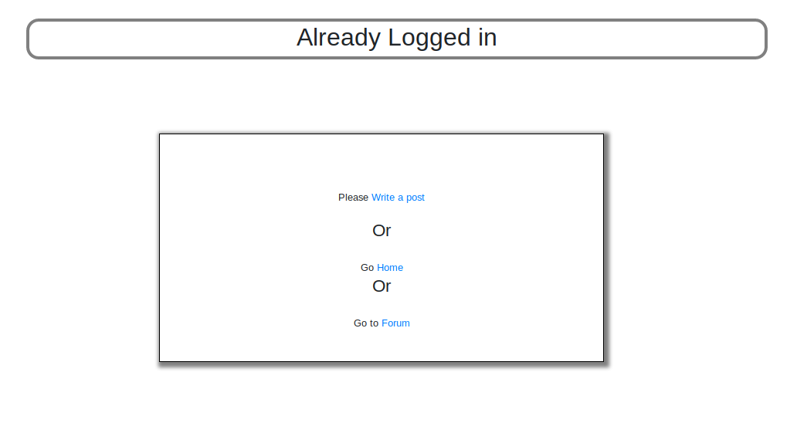
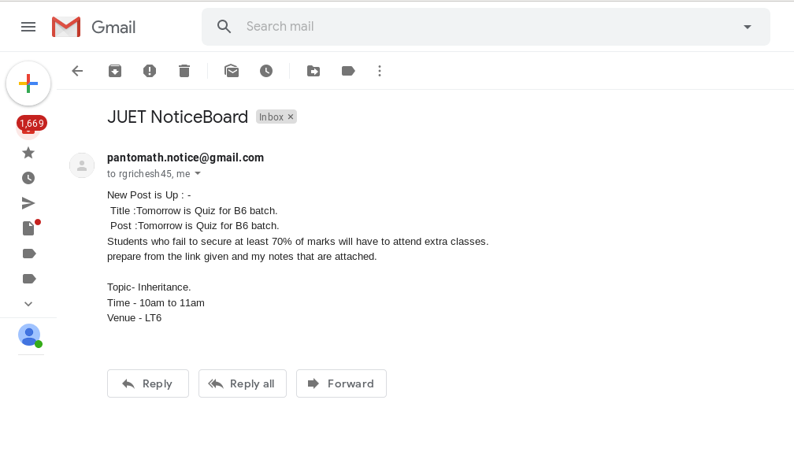
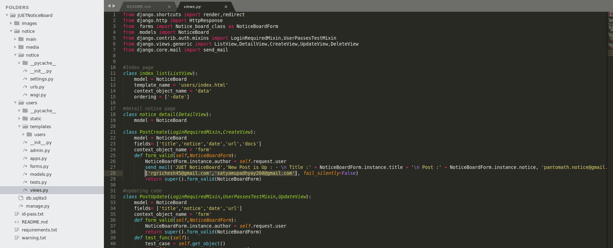
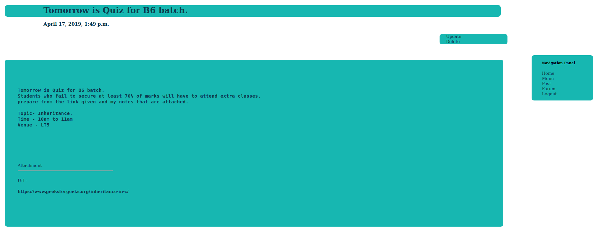
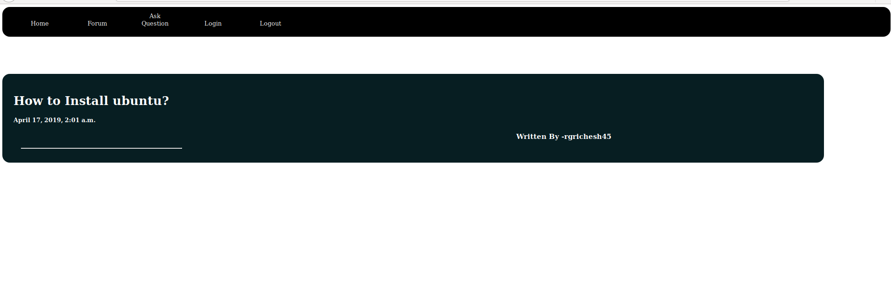
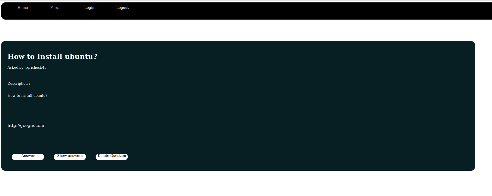

## Requirements
* Django 	 = 2.0.7

* Python 	 = 3.6

* Crispy Forms = 1.7.2

* Latest version of **Pip** 

***

## About Project
We, the Pantomath, have tried creating a project to solve the real-life problem of our faculty members of conveying information to the students. If any teacher wanted to convey any message to any batch then they first had to tell it to the Class Representative (CR) and then the CR would further convey it to the batch students. In this process there is a lot of information gap that leads to wrong analysis of the information. So, with our little knowledge about Web Development we tried to create one stop for students and faculty members that would let teachers directly post about anything and the students could get the information directly from here. The post would include: 
	
**TITLE**	: Title of the Post (Required)

**CONTENT**	: All information about the post (Required)

**DATE**	: Date and time of the post 

**URL**		: To provide any link to website (Optional)

**DOCS**	: To provide any study material (Optional)

***

# Description of Project

## Introduction Page
The very first page that comes up is the introduction page. Here you can select wheather you are a faculty member or student. You can select either of the option and continue accordingly. If you are a faculty meneber then you will be directed to the login page where you can **SignIn** and provide the content to the students by filling up the form.

## Home Page
Once you click on the faculty button a form will appear where you can signin using your id and password which is provided in the file named **id-pass.txt**. Once you are signed in the home page will appear where  there are different options like:  

* Menu : On clicking on this buttton you will be redirected to the inroduction page where you have to again select wheather you want to login as faculty member or continue as student. If you again click on faculty button then a prompt box appears where you can directly select wheather you want to write a post, go to the home page or directly move to the forum.

* Notice: This button will direct you the main form of the post. Here the faculty members can fill up the form accordingly and post it. The content will be posted on the home page and an email would also be sent to the registered email ids. 

   

**NOTE**: If you want to add your own email id you can do it by simply writing your email in space highlighted.

* Forum : We will be explaining the forum feature later on.

* About : Lastly if you want to contact us you can use our GitHub and LinkdIn id profiles. 

##  Detailed Post Features
Whenever a faculty uploads a  new post, he can view the post by simply clicking on it. A new tab will be opened and a detailed description of the post will be shown here. The faculty member can also perform update and delete operarions on the post by just simply clicking on the buttons provided on the top right corner. A point to be noted here is that the admin who has uploded the post can only perform any changes to the post, in any other admin account the option of update and delete will not be shown. Once any changes are made in the post it will directly visible on the home page. A naviagtion panel is also provided here which performs differrent tasks like directing you to home page and introduction page, to add a new post or a forum and you can also logout from the admin account from here. 

# Forum Feature
This is the most fascinating feature of our Project. We have tried creating a place where new students who are facing any problem 
can directly ask questions anything relevant to our college and anyone having a solution can answer it.    

Anyone who wants to answer the question can click on the question and the details of the question will be shown. There are different options at the bottom of the page like answer, show answers and delete answer. If you want to answer the question you can by clicking on the answer button and if you want to see all the related answers to the question you can view it by clicking on show answers button. The person who has aksed the question can delete the question also but if any other admin account wants to delete the question of other admin it is not possible and you will be directed to the login page. When you are answering the question a form appears in which you can answer any question by selecting it.

