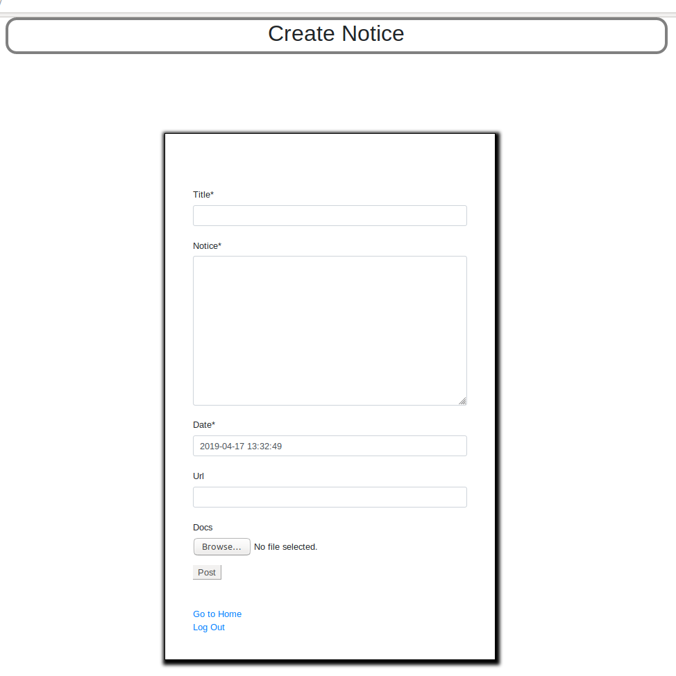

## Requirements
* Django 	 = 2.0.7

* Python 	 = 3.6

* Crispy Forms = 1.7.2

***

## About Project
We, the Pantomath, have created this project to solve a real-life problem of our faculty members of conveying information to the students. If any teacher wanted to convey any message to any batch then they first had to tell it to the Class Representative (CR) and then the CR would further convey it to the batch students. In this process there is a lot of information gap that leads to wrong analysis of the information. So, with our little knowledge about Web Development we tried to create one stop for students and faculty members that would let teachers directly post about anything and the students could get the information directly from here. The post would include: 
	
**TITLE**	: Title of the Post (Required)

**CONTENT**	: All information about the post (Required)

**DATE**	: Date and time of the post 

**URL**		: To provide any link to website (Optional)

**DOCS**	: To provide any study material (Optional)

***

# Description of Project

## Introduction Page
The very first page that comes up is the introduction page. Here you can select wheather you are a faculty member or student. You can select either of the option and continue accordingly. If you are a faculty meneber then you will be directed to the login page where you can **SignIn** and provide the content to the students by filling up the form.

